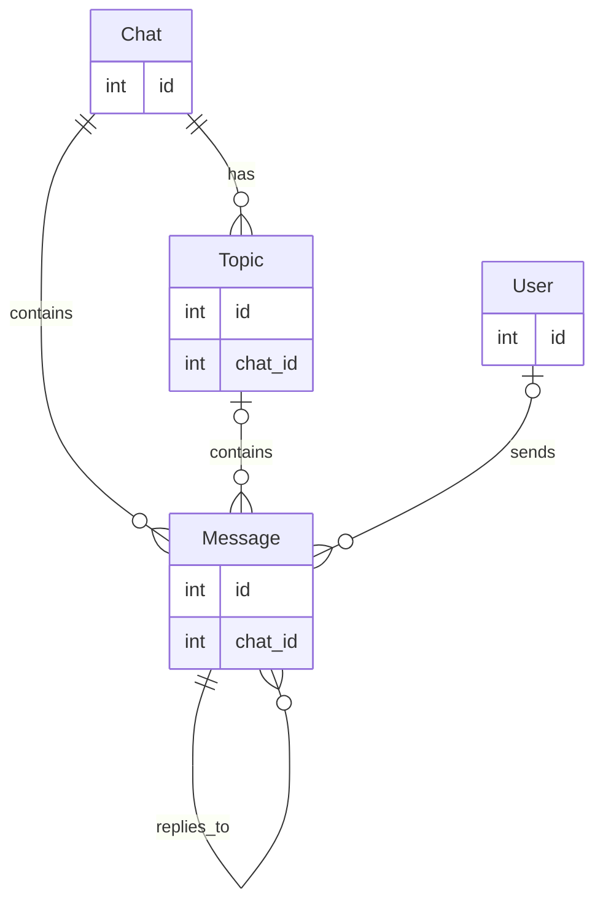

# ChatGPT Telegram Bot

ChatGPT interface using Telegram's bot API. The bot is currently hosted at
[@MohdFareed_ChatGPT_Bot](https://t.me/MohdFareed_ChatGPT_Bot).

## Setup

### Requirements

- Python
- Docker

### Installation

Download the repository and run the setup script:

```sh
git clone https://github.com/mohdfareed/chatgpt-telegram.git
cd path/to/chatgpt-telegram
./scripts/setup.py [--clean]
```

- The `--clean` flag will remove the existing virtual environment.

Fill in the provided example environment file and renamed it to `.env`.

### For local development

If developing `chatgpt` alongside the bot locally, run:

```sh
cd path/to/chatgpt-telegram
source .venv/bin/activate
pip install -e /path/to/chatgpt
```

## Usage

Start the bot using the virtual environment:

```sh
cd path/to/chatgpt-telegram
source .venv/bin/activate
./scripts/start.py [--debug] [--log] [--clean]
```

- `--debug`: flag will log debug messages. Defaults to logging info messages.
- `--log`: flag will log messages to a file. Defaults to logging to stdout.
- `--clean`: flag will remove the existing database docker container and will
    not restore the database from a backup.

## Database

The database is a docker container running a PostgreSQL database. It acts as a
persistent storage for the bot. The database contains inforamtion that builds
the context of the conversation. The following is the database schema:



## Pre-Made System Prompts

The bot comes with a few pre-made prompts that can be presented to the user.
The prompts are stored in `chatgpt_bot/prompts.txt`. Text proceeding the first
title is considered the default prompt for the bot. The default's prompt's
name is `Default`, unless changed in the source code. Each prompt starts with
a title and is followed by the prompt itself. The file has the following format:

```markdown
# Default (optional)
The default prompt's content.

# Title
The prompt's content.

# Another Title
Another prompt's content.
```

The prompts' content is trimmed of leading and trailing whitespace, allowing
for better organization of the prompts in the file.
