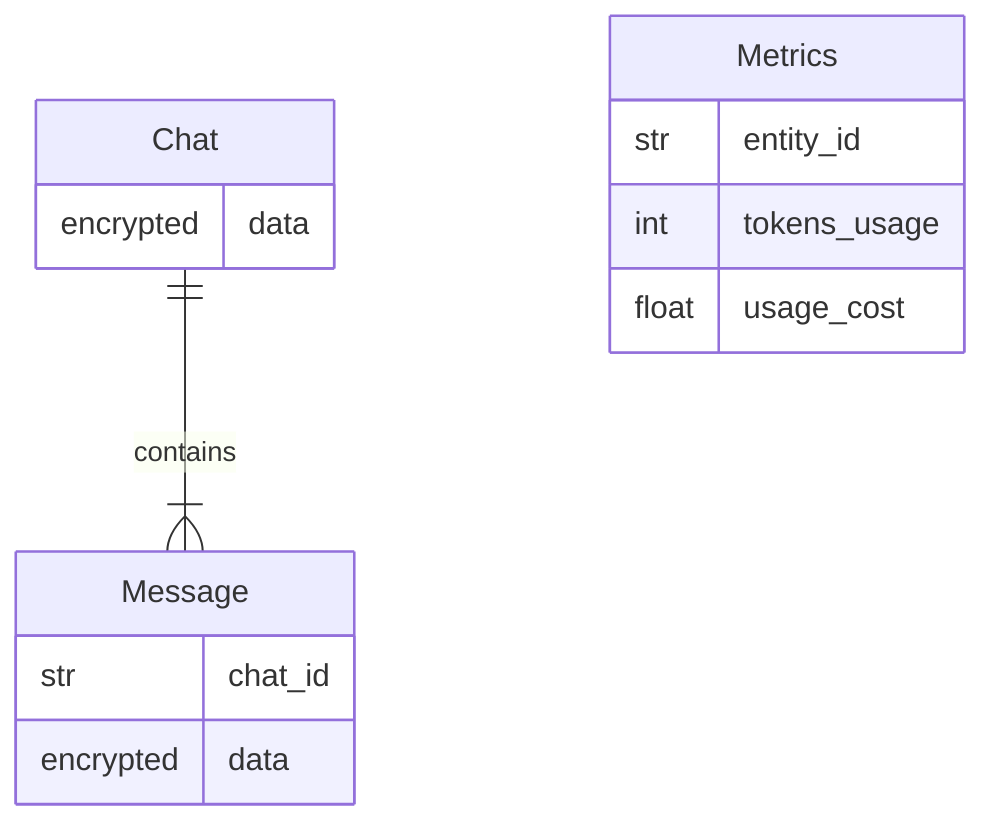

# ChatGPT Telegram Bot

ChatGPT interface using Telegram's bot API. The bot is currently hosted at
[@chatgpt_mohdfareed_bot](https://t.me/chatgpt_mohdfareed_bot).

## Setup

### Requirements

The following environment variables are required:

- `OPENAI_API_KEY`: OpenAI API key
- `TELEGRAM_BOT_TOKEN`: Telegram bot token

The following environment variables are optional:

- `DATABASE_URL`: Database URL for persistent storage
- `ENCRYPTION_KEY`: Encryption key for encrypting database
- `WEBHOOK`: Webhook URL for Telegram bot, defaults to polling (development)
- `WEBHOOK_ADDR`: Webhook address for Telegram bot
- `WEBHOOK_PORT`: Webhook port for Telegram bot

### Installation

Download the repository and run the setup script:

```sh
git clone https://github.com/mohdfareed/chatgpt-bot.git
cd path/to/repo
./scripts/setup.py [--clean]
```

- The `--clean` flag will remove the existing virtual environment.

Fill in the provided example environment file and renamed it to `.env`.

### For local development

Run the bot using the container:

```sh
cd path/to/chatgpt-telegram
docker build -t chatgpt-bot .
docker run --rm --env-file .env chatgpt-bot
```

## Usage

Start the bot using the virtual environment:

```sh
cd path/to/chatgpt-telegram
source .venv/bin/activate
./scripts/start.py [--debug] [--log] [--clean]
```

- `--debug`: flag will log debug messages. Defaults to logging info messages.
- `--log`: flag will log messages to a file. Defaults to logging to stdout.
- `--clean`: flag will remove the existing database docker container and will
    not restore the database from a backup.

### Bot Commands

The bot supports the following commands:

- `/start`: start the bot, sending a help message
- `/delete_history`: delete the chat history
- `/usage`: get the user and chat's usage

## Technical Overview

### Database

The database holds all information used by models. It is the memory used by all
models. The database is encrypted using Fernet symmetric encryption. The
following is the database schema:



The metrics table is not accessed by a model, it is used for tracking usage of
users. The model ID represents any entity that uses the model, such as a user
ID or a chat ID.

### Tool Template

To create a new tool, use the following template, where `tool_function` is the
function that will be called when the tool is run:

```python
class ToolName(chatgpt.tools.Tool):
    def __init__(self):
        self.name = "tool_name"
        # the following are optional
        self.description = (
            "The description of the tool."
        )
        self.parameters = [
            chatgpt.tools.ToolParameter(
                name="arg_name",
                type="string",
                # the following are optional
                description="A parameter description.",
                enum=["possible_val_1", "possible_val_2"],
                optional=True,
            ),
        ]

    @override
    async def _run(self, arg_name: str, ...) -> str:
        # arguments names/types must match the tool's parameters' names/types
        return await tool_function(arg_name, ...)
```
